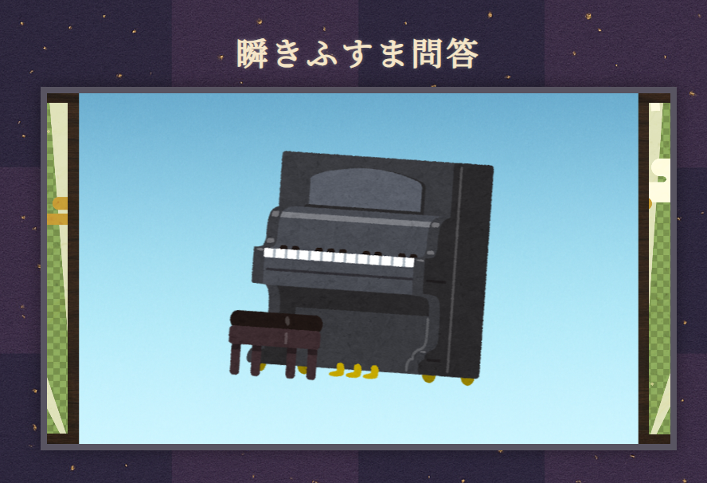

# 瞬きふすま問答（またたきふすまもんどう）

---

## 🎯 概要

ふすまの隙間から一瞬だけ流れる絵を見極め、正解を当てる和風演出クイズゲーム

- React + Hooks 構成
- 状態管理による画面遷移（開く → 流れる → 閉じる → 選択肢表示）
- 完全オリジナル演出付き
- 時代劇風メッセージによる世界観強化

---

## 🛠 使用技術

- React（Viteベース予定）
- JavaScript（ES6+）
- HTML / CSS3
- 状態管理：useState, useEffect
- Git / GitHub（バージョン管理）

---

## ✨ 主な機能

- スタートボタンでゲーム開始
- ふすまが開き、画像が流れる演出
- スクロール終了後、ふすまが閉じ、選択肢表示
- 正解／不正解の結果表示（時代劇風メッセージ）
- リザルト画面（スコア表示・再挑戦ボタン）
- フルスクリーン対応・レスポンシブ設計予定

---

## 📷 スクリーンショット（仮）

---

## 🎮 今後のアップデート予定

- 音演出（開閉音・正解/不正解SE）
- スマホ向けレイアウト最適化
- ハイスコア記録

---

## 🐲 作者

- 制作・演出・実装：Jozet42
- 監修・サポート：OpenAI ChatGPT

---

## 📝 更新履歴

- 2025/04/17：初回コミット
- 2025/04/18：クイズアプリ機能実装（出題・解答・正誤判定）
- 2025/04/24：コンポーネント単位に分割構成（QuizScreen / StartScreen / ResultScreen）
- 2025/04/24：useQuiz カスタムフック導入・App構造整理
- 2025/04/24：CSSファイルの分離とスタイル調整
- 2025/04/24：出題ロジックを7問→ランダム5問選出に変更、結果画面表示の修正
- 2025/04/24：クイズ問題をJSONファイルで外部管理に移行
- 2025/04/25：画面を装飾、CSS追加に伴って動作を修正
- 2025/04/28：演出調整：襖開閉アニメ追加・閉じる速度調整・選択肢表示タイミング修正
- 2025/04/28：完成版リリース：瞬きふすま問答 演出・デザイン・機能仕上げ
- 2025/05/08：難易度追加：襖の開き加減を設定
- 2025/05/08：難易度調整：速度設定を追加
- 2025/05/09：開始画面装飾
- 2025/05/09：レスポンシブ対応
- 2025/05/12：難易度調整：問題に傾きを追加
- 2025/05/12：VITE版作成
